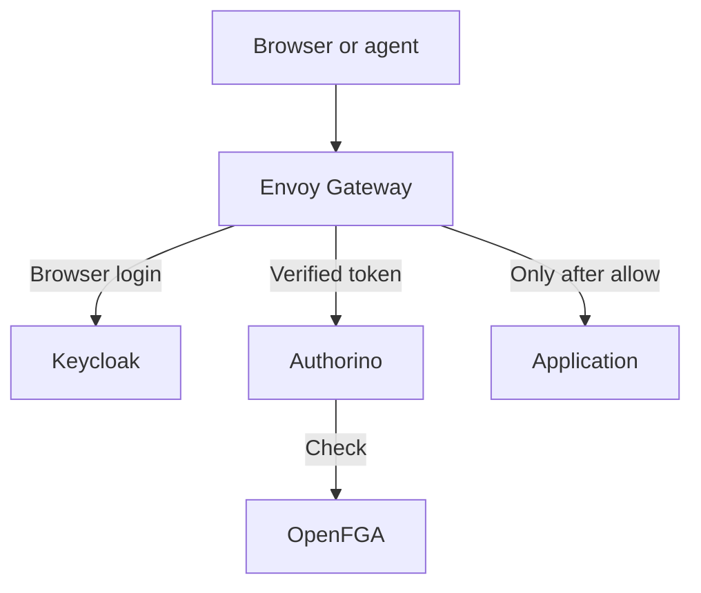

# Identity and permissions

## Request path



The OAuth2 filter runs before JWT validation, which runs before external authorization. Browsers receive an OIDC redirect; machine clients can supply a Keycloak access token with audience `astra-edge`. Authorino verifies the signature again, checks issuer/audience, calls OpenFGA, and accepts only an explicit boolean allow. There is no permission cache in Authorino/OpenFGA's configured Check path. A missing model, absent tuple, invalid JWT, failed request or authorization timeout denies access. Valid signed JWTs can remain usable until expiry during a Keycloak outage; this is normal offline JWT verification, not a fallback to anonymous access.

The check is `principal:<Keycloak sub> access service:<lowercase hostname without port>`. A service account has its own stable subject and therefore independent grants. Email addresses are not permission identifiers. Cilium permits Authorino to call only OpenFGA's Check endpoint; it does not give application pods access to OpenFGA's write/admin API. The OpenFGA preshared key is itself powerful, so its Secret and the authorization namespace are platform-admin resources. Do not give it to ordinary applications or agents. Use scoped access through a reviewed gateway/OIDC design if applications later need authorization APIs.

This baseline enforces service admission, not operation-level authorization inside arbitrary software. Longhorn access is effectively dashboard administration: OpenFGA cannot retrofit storage-operation roles into a UI/backend that does not implement them. Assign that grant carefully.

## Initialize OpenFGA

In one terminal, with an admin kubeconfig:

```sh
kubectl -n authorization port-forward service/openfga 8080:8080
```

In another:

```sh
umask 077
kubectl -n authorization get secret openfga-key -o jsonpath='{.data.keys}' \
  | base64 --decode > local/openfga.key
bash scripts/bootstrap-openfga.sh local/openfga.key
```

Copy the printed store/model IDs into `clusters/laptops/settings.yaml`, commit and push. IDs are not secrets. The script creates an immutable authorization model using the official API and records partial progress in `local/openfga-state.json`. If it fails after creating the store, reuse that store; do not repeatedly create new ones. Reapply a corrected model to the existing store and record the newly returned model ID. Models are immutable; there is no silent migration to “latest”.

Find your user UUID (`sub`) in Keycloak's `astra` realm. Prepare this request with the actual UUID and hostname in `local/first-grant.json`:

```json
{
  "writes": {
    "tuple_keys": [
      {"user": "principal:KEYCLOAK_USER_UUID", "relation": "access", "object": "service:longhorn.apps.YOUR_DOMAIN"}
    ]
  }
}
```

Send it through the localhost port-forward using a header file, keeping credentials out of process arguments:

```sh
umask 077
printf 'Authorization: Bearer %s\n' "$(cat local/openfga.key)" > local/openfga.header
FGA_STORE_ID=$(jq -r .store_id local/openfga-state.json)
curl --fail-with-body --header @local/openfga.header --header 'Content-Type: application/json' \
  --data-binary @local/first-grant.json "http://127.0.0.1:8080/stores/$FGA_STORE_ID/write"
```

For a group, write `principal:UUID member group:platform-admins` and then `group:platform-admins#member access service:longhorn.apps.YOUR_DOMAIN`. Keycloak groups and OpenFGA groups are intentionally separate stores; nothing here falsely claims to synchronize them. Manage membership through OpenFGA's documented API/CLI or your future application's lifecycle. Back up the OpenFGA database. Do not store production user membership lists in this public repository.

## Local users and Google

Keycloak supports local credentials independently of Google or paid company mail. Keep self-registration off until you define an invitation policy. Configure SMTP before relying on password recovery or email verification. Add Google's identity provider in Keycloak when you have a Google OAuth client; store its secret in Keycloak's database/secure administration flow. Use an explicit first-broker-login flow and verified account linking. Do not automatically merge accounts just because an external provider claims the same email. Configure MFA/WebAuthn using Keycloak's supported authentication flows.

The realm ConfigMap is a **first-start import**. Keycloak skips importing an already existing realm. Editing it in Git will not silently change an existing production realm. Day-two changes and dynamic clients/projects use Keycloak's Admin API, `kcadm.sh`, or admin console. This is documented upstream behavior; there is no homegrown reconciler maintaining pretend GitOps state. Review/record important identity configuration changes separately and protect database backups.

## Dynamic projects and routing

Use one `astra` realm with clients, groups/organizations and OpenFGA objects for most projects. A Keycloak client or organization is not a Kubernetes Service. Creating one cannot automatically deploy an application or grant traffic. A new project needs:

1. An application Service and workload, and either an exact HTTPRoute or a wildcard HTTPRoute for an existing multi-tenant application. Copy `examples/protected-app/` into a reconciled directory.
2. An **exact** `https://HOST/oauth2/callback` registered on the `astra-edge` Keycloak client. Preserve existing callbacks when updating the list using the Admin API. The gateway uses the requesting hostname and host-only cookies; it does not share a bearer cookie over all sibling domains. Do not register `*` or claim Keycloak supports arbitrary hostname wildcards.
3. Explicit OpenFGA grants on `service:HOST`. Wildcard DNS/certificates/routes do not create wildcard permission grants. An unprovisioned tenant hostname has no access.

Routes automatically inherit the apps listener policy. Authentication is not duplicated in every HTTPRoute. The native Kubernetes guard rejects routes outside `edge`, the wrong parent listener, raw ingress/TCP routes and security-policy overrides. Route authors are trusted platform automation; application namespaces do not get those permissions.

An application with a genuine native OIDC integration may be added as an explicit reviewed exception, following the Keycloak pattern: a separate exact-host listener and matching route/backend allowlist in `infrastructure/admission/guards.yaml`, plus its own audience, callback and native access checks. Update the two-listener guard at the same time. This deliberate change is necessary: simply adding an “auth disabled” annotation is not a safe native-auth exemption. Keep default applications on the protected listener.

Multiple independent Keycloak realms have different issuers. They need explicit trusted issuer/audience policies; never choose a JWKS URL or issuer from unvalidated client input. For most dynamic projects, avoid creating a realm per project and use the single issuer design above.

## Agents, delegation and resource gateways

| Case | Credential | Required authorization |
| --- | --- | --- |
| Autonomous agent | Dedicated confidential Keycloak client/service account; short-lived access token | OpenFGA grants to that service account's subject |
| Agent acting for a user | Supported Keycloak standard token exchange, scoped client and target audience | User permission **and** the delegation/agent's allowed operation and resource scope |
| Gateway to a resource the user cannot access directly | User authenticates to gateway; gateway uses a separate backend service identity | User may invoke the constrained gateway operation; gateway may access the backend; user gains no backend credential |

Disable password grants for clients. Prefer workload-specific clients and asymmetric client authentication where the upstream client supports it. Never hand every model/agent the bootstrap admin or OpenFGA key. Configure token-exchange permissions explicitly and narrow audience/scope. Keycloak's standard exchange is not a universal actor-token/impersonation solution; consult its supported grant semantics before choosing a delegation protocol.

OpenFGA can model relationships and intersections, but tokens and relationships do not automatically enforce themselves inside future applications. For user delegation, the resource server must validate the token, bind the authenticated actor and user to a recorded grant, check its scope/expiry, and apply both permission checks. A plain “act-as” header or the user's broad token is insufficient. For the gateway case, keep backend network access restricted to that gateway and authorize the public operation separately. Do not pass backend service credentials to the user.

The included policy implements the autonomous-agent/service-entry case. Fine-grained delegation and gateway business operations require the future **application's existing supported integration** or application logic. They are not represented as solved by a generic ingress rule, and no custom foundation service is created here. Authenticated headers alone are not a permission system. Treat access tokens delivered to an upstream as credentials and keep untrusted applications on distinct clients/audiences when designing their integration.
